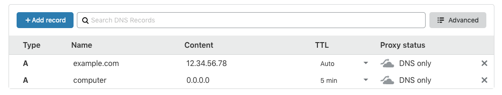
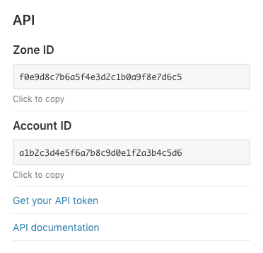
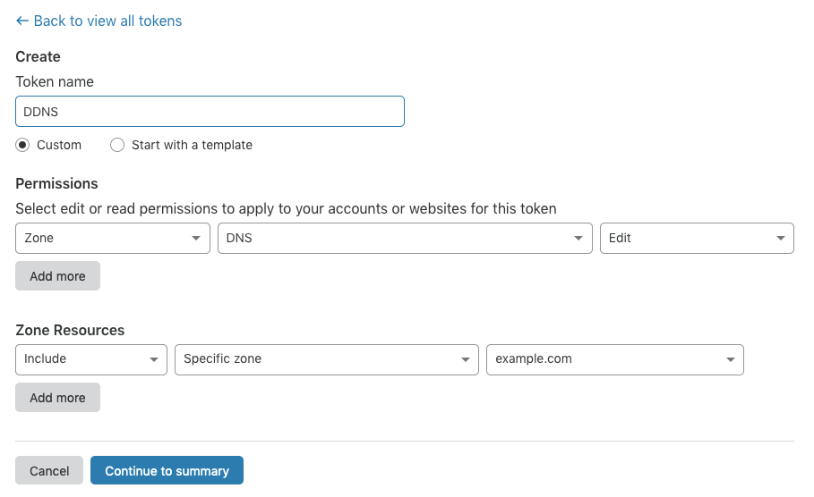
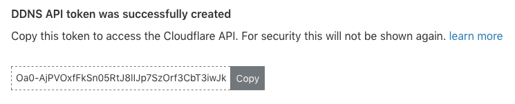

Cloudflare DDNS
===============

A command-line utility which updates the value of a Cloudflare DNS record to your public IP.

```
$ cloudflare-ddns-update \
   --record-name computer.example.com \
   --zone-id f0e9d8c7b6a5f4e3d2c1b0a9f8e7d6c5 \
   --auth-token Oa0-AjPVOxfFkSn05RtJ8lIJp7SzOrf3CbT3iwJk
Public IP: 123.45.678.90
Successfully updated computer.example.com!
```


Setup
-----

Prerequisite: Your domain must already be managed by Cloudflare.

 * Step 1: On the "DNS" page for your domain, add an A record with the desired name and a dummy IP
   address such as 0.0.0.0.
   
   
   
   This will become the `--record-name` argument value. Note that in this example a name of
   "computer" for the "example.com" domain means that the full argument value should be
   "computer.example.com".
   
 * Step 2: On the "Overview" page, record the "Zone ID" value from the "API" section.
 
   
   
   This will become the `--zone-id` argument value.

 * Step 3: In that same "API" section, click "Get your API token". Create a new token with
   permission to edit DNS for a zone and specify the specific zone corresponding to the domain.
 
   
   
   Click "Continue to summary" and then "Create token". Record the token value.
   
   
   
   This will become the `--auth-token` argument value.
   
 * Step 4: Invoke the `cloudflare-ddns-update` command with these three argument values.
 
   ```
   $ cloudflare-ddns-update \
       --record-name computer.example.com \
       --zone-id f0e9d8c7b6a5f4e3d2c1b0a9f8e7d6c5 \
       --auth-token Oa0-AjPVOxfFkSn05RtJ8lIJp7SzOrf3CbT3iwJk
   Public IP: 123.45.678.90
   Successfully updated computer.example.com!
   ```
   
   You can check the "DNS" page again to verify that the record was updated with the correct IP.

Steps 1-3 need to only be performed once. The command in Step 4 should be set up to run
periodically, such as in a cron job.


Usage
-----

```
$ cloudflare-ddns-update --help
cloudflare-ddns-update 0.1.0

USAGE:
    cloudflare-ddns-update --auth-token <auth-token> --record-name <record-name> --zone-id <zone-id>

FLAGS:
    -h, --help       Prints help information
    -V, --version    Prints version information
    -v, --verbose    Enable verbose logging

OPTIONS:
        --auth-token <auth-token>      API token generated on the "My Account" page
        --record-name <record-name>    DNS record "name" from domain "DNS" page
        --zone-id <zone-id>            Zone ID from domain "Overview" page, "API" section
```


Install
-------

```
$ cargo install cloudflare-ddns-update
```


License
-------

    Copyright 2020 Jake Wharton

    Licensed under the Apache License, Version 2.0 (the "License");
    you may not use this file except in compliance with the License.
    You may obtain a copy of the License at

       http://www.apache.org/licenses/LICENSE-2.0

    Unless required by applicable law or agreed to in writing, software
    distributed under the License is distributed on an "AS IS" BASIS,
    WITHOUT WARRANTIES OR CONDITIONS OF ANY KIND, either express or implied.
    See the License for the specific language governing permissions and
    limitations under the License.
